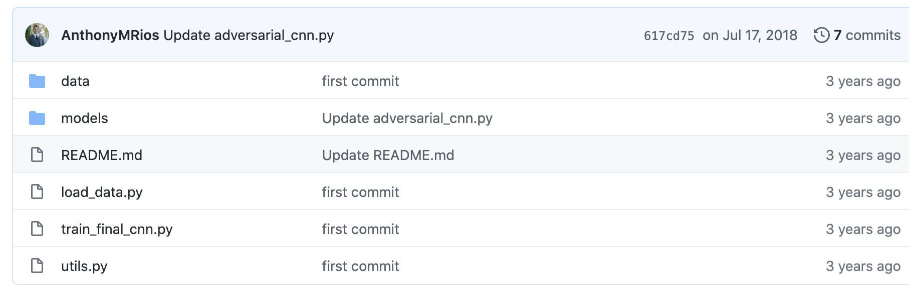
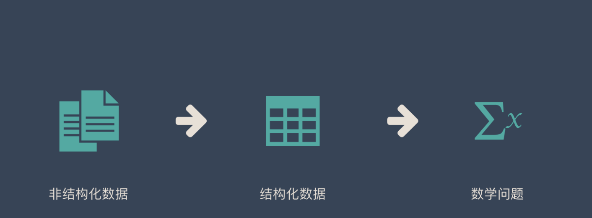

https://zhuanlan.zhihu.com/p/38200980

https://github.com/AnthonyMRios/adversarial-relation-classification

tokenization，也叫word segmentation,是一种操作，它按照特定需求，把文本切分成一个字符串序列(其元素一般称为token，或者叫词语)。一般来说，我们要求序列的元素有一定的意义，比如“text mining is time-consuming”需要处理成"text mining/ is/ time-consuming"，其中"text mining"表示"文本挖掘"。

如果我们把语料中所有的token做一个去重，就得到了一个词汇表，其中的每一个词语被称为type。

英文信息处理中,tokenization需要把"I'm Li"这样的句子转换为"I am Li"，即将一些词语、短语的写法规范化。中文由于文字本身没有形态变化、不需要太多的规范化操作，大家关注的主要的是切分操作，即分词。

tokenization(标识化)：是将文本分割为一小块一小块，例如以**一个单词/几个连续单词为单位（即token，有具体的意义）**，这样子的操作目的在于更好地分析文本信息的内容和文本想表达的含义。

所以，我们能够看出来，**标识化（tokennization）侧重于过程，而tokens侧重于标识化结果**

https://easyai.tech/ai-definition/tokenization/

### 分词 – Tokenization

- **给予词典匹配的分词方式**

优点：速度快、成本低

缺点：适应性不强，不同领域效果差异大

基本思想是基于词典匹配，将待分词的中文文本根据一定规则切分和调整，然后跟词典中的词语进行匹配，匹配成功则按照词典的词分词，匹配失败通过调整或者重新选择，如此反复循环即可。代表方法有基于正向最大匹配和基于逆向最大匹配及双向匹配法。

- **基于统计的分词方法**

优点：适应性较强

缺点：成本较高，速度较慢

这类目前常用的是算法是**HMM、CRF、[SVM](https://easyai.tech/ai-definition/svm/)、深度学习**等算法，比如stanford、Hanlp分词工具是基于CRF算法。以CRF为例，基本思路是对汉字进行标注训练，不仅考虑了词语出现的频率，还考虑上下文，具备较好的学习能力，因此其对歧义词和未登录词的识别都具有良好的效果。

- **基于深度学习**

优点：准确率高、适应性强

缺点：成本高，速度慢

例如有人员尝试使用双向[LSTM](https://easyai.tech/ai-definition/lstm/)+CRF实现分词器，其本质上是序列标注，所以有通用性，命名实体识别等都可以使用该模型，据报道其分词器字符准确率可高达97.5%。

**常见的分词器都是使用机器学习算法和词典相结合，一方面能够提高分词准确率，另一方面能够改善领域适应性。**

## 中文分词工具

下面排名根据 GitHub 上的 star 数排名：

1. [Hanlp](https://github.com/hankcs/HanLP)
2. [Stanford 分词](https://github.com/stanfordnlp/CoreNLP)
3. [ansj 分词器](https://github.com/NLPchina/ansj_seg)
4. [哈工大 LTP](https://github.com/HIT-SCIR/ltp)
5. [KCWS分词器](https://github.com/koth/kcws)
6. [jieba](https://github.com/yanyiwu/cppjieba)
7. [IK](https://github.com/wks/ik-analyzer)
8. [清华大学THULAC](https://github.com/thunlp/THULAC)
9. [ICTCLAS](https://github.com/thunlp/THULAC)

## 英文分词工具

1. [Keras](https://github.com/keras-team/keras)
2. [Spacy](https://github.com/explosion/spaCy)
3. [Gensim](https://github.com/RaRe-Technologies/gensim)
4. [NLTK](https://github.com/nltk/nltk)

# Word2vec

https://easyai.tech/ai-definition/word2vec/

# HunFlair: An Easy-to-Use Tool for State-of-the-Art Biomedical Named Entity Recognition