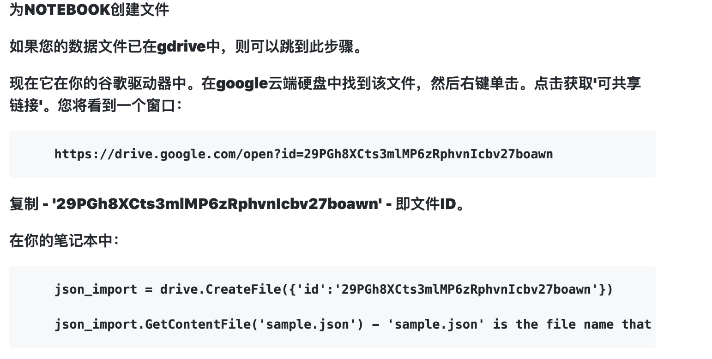

Google Colab

- Google Colab ( Google Colaboratory)是一個以Jupyter Notebook 為開發環境的免費雲端服務
- 可選擇Python 2 或 Python 3
- 提供免費的 GPU (K80) 和 TPU (v2)
- 最長可運行12小時，若閒置過久則會中途自動停止執行
- 可連結自身Google帳號的雲端硬碟做資料操作

Google Drive

- Google 雲端硬碟
- PyDrive 中須注意路徑的指定方式與一般程式寫法不同。並非 ./folder/file.* 這種形式，而是需要指定資料夾的 id
- PyDrive 中需要的 id 取得方法之一為 【右鍵檔案/資料夾 -> 取得檔案共用連結 -> 開啟設定 -> 從連結中擷取 [*https://drive.google.com/open?id=****TARGET\*_FILE_ID**](https://drive.google.com/open?id=TARGET_FILE_ID)】例如：[*https://drive.google.com/open?id=****1icWmsJmTYsIuMNPBKLdrEh7KXmJJoEoR\***](https://drive.google.com/open?id=1icWmsJmTYsIuMNPBKLdrEh7KXmJJoEoR)
- 提供範例程式檔[*https://colab.research.google.com/drive/17n6KdLKrWRhyHBNlyUWKEh7SriAb1qS9*](https://colab.research.google.com/drive/17n6KdLKrWRhyHBNlyUWKEh7SriAb1qS9)
- 此篇文章中會將Google Drive當作資料庫，透過Colab的程式，執行檔案的存儲、取用以及獲得檔案的共用連結

https://medium.com/@fsflyingsoar/%E7%AD%86%E8%A8%98-for-python-google-colab-google-drive-e0f2a569fb7f


## **安裝 PyDrive套件**

```
!pip install PyDrive
```


## **完整範例**

- 身分驗證 - 使用者驗證

```
from pydrive.auth import GoogleAuth
from pydrive.drive import GoogleDrive
from google.colab import auth
from oauth2client.client import GoogleCredentialsgauth = GoogleAuth()
auth.authenticate_user()
gauth.credentials = GoogleCredentials.get_application_default()
drive = GoogleDrive(gauth)

```

- 身分驗證 - 自動化驗證

```
from pydrive.auth import GoogleAuth
from pydrive.drive import GoogleDrive
from google.colab import auth
from oauth2client.client import GoogleCredentialsgauth = GoogleAuth()gauth.LoadCredentialsFile("mycreds.txt")if gauth.credentials is None:
  auth.authenticate_user()   
  gauth.credentials = GoogleCredentials.get_application_default()
    
elif gauth.access_token_expired:
  gauth.Refresh()
    
else:
  gauth.Authorize()gauth.SaveCredentialsFile("mycreds.txt")drive = GoogleDrive(gauth)
```

- 檔案操作 - 取得共用連結

```
file_list = drive.ListFile({'q': "'1icWmsJmTYsIuMNPBKLdrEh7KXmJJoEoR' in parents and trashed=false"}).GetList()
for file1 in file_list:
  print('title: %s, id: %s' 
        %(file1['title'], file1['webContentLink']))
```

https://zhuanlan.zhihu.com/p/35063343


**在Google Colaboratory中保存和恢复文件**
在这篇文章中，我将介绍在Google Colaboratory中处理文件的两种方法，我认为这些方法最常用。要处理的文件通常包括训练或测试数据，以及保存的模型数据（即检查点或完全训练的模型数据）。

在Google Colaboratory中加载和下载文件的最简单方法是使用内置的文件夹结构浏览器。单击菜单中的视图 - >目录将启动左侧窗格/菜单。在此窗格的顶部，将出现一个名为“文件”的选项卡 - 选择此选项将显示当前运行时会话的文件结构，您可以从本地PC上载和下载该文件结构。

或者，可以通过运行以下命令以编程方式执行此操作：

```python3
from google.colab import files
uploaded = files.upload()
```

不幸的是，这意味着您还将失去所有培训进度和模型数据。换句话说，能够在训练时以编程方式存储文件/检查点非常重要。在下面的示例中，我将向您展示如何设置一个自动将检查点存储到您的Google云端硬盘帐户的培训回调，然后可以将其下载并稍后再次使用。我将在训练TensorFlow / Keras模型来分类CIFAR-10图像的背景下进行演示。有关详细信息，请参阅我的教程或我的书。

到现在为止还挺好。但是，这是一种非常手动的文件播放方式。这在训练期间是不可能的，因此使用此方法将检查点存储在Google Colaboratory的本地驱动器中是不可行的。另一个问题是当您在Google Colaboratory上运行长期训练课程时。如果您的训练结束并且您暂时不与控制台交互（即，您在训练结束时进行了一夜训练并且您已经睡着了），您的运行时将自动结束并释放以释放资源。

**使用Keras和回调的文件保存示例**
首先，我将向您展示所需的导入，使用Dataset API进行数据准备，然后是Keras模型开发。我不会解释这些，因为前面提到的教程中概述了详细信息，因此如果您想更好地理解模型，请检查一下。我们将使用PyDrive软件包与Google云端硬盘进行所有通话，因此首先您必须在会话中安装它：


### 解决Google Colab - 上传数据集慢 - pytorch读取数据慢

**解决方法**：先将数据集压缩打包，然后传压缩包到谷歌云端，再Colab用解压，速度可以快很多。

```python
# 解压缩文件
# (我不会 我百度的 但是能用 嘻嘻)
import zipfile
file_dir = '/content/drive/My Drive/Colab Notebooks/pokemon8600.zip'  # 你的压缩包路径
zipFile = zipfile.ZipFile(file_dir)
for file in zipFile.namelist():
    zipFile.extract(file, '/content')  # 解压路径
zipFile.close()
```

### pytorch读取数据慢

刚开始用(嫖)Colab训练，可能发现训练比线下慢很多，博主用pytorch遇到了这个情况，不知道TensorFlow会不会这样。
原因是数据集放在了`'/content/drive'`路径下，这样读取就很慢
**解决方法**：把数据移到`/content`下就好了
**注意**`/content`在云端是看不到的，在Colab里装载了云端能看到。另外现在装载云端不需要用代码了，好多教程比较老，放了好多连接云端的代码，现在直接点一下就好了…

```python
# 拷贝文件到 /content
import shutil
shutil.copyfile('/content/drive/My Drive/Colab Notebooks/Img', '/content/Img') 
```

挂载只有12个小时，也就是说12小时之后你就需要重现挂载一次，所以就需要我们在进行模型训练的时候记得要加上==checkpoint==，不然你如果训练的模型超过12小时，Google断开挂载你就白白浪费12小时啦。

每次使用都需要重新配置你上次自己安装的环境，默认环境当然就不用啦。还有就是CUDA和Cudnn不需要重新配置（亲测），我也不知道为什么...欢迎指正。然后给大家安利一个方法，就是独立出一个页面把你要配的环境的代码都写在该页面下，下次打开只需要运行所有单元格就可以再开一个页面来跑你需要跑的程序啦。

模型在训练的过程中 有可能会出现连接中断需要重新连接的情况，不要怕点击重新连接就行，如果经常出现推荐给大家一个脚本神器**按键精灵，**人不在电脑边上只需要F10启动脚本左键点击功能


https://zhuanlan.zhihu.com/p/144808681

### 如何使用Python管理Google Drive文件

使用Python的Google Drive API第一部分：设置凭据

Python: download files from google drive using url

483397536903-qnohng9dadc9ok7i0b0lpad23414k29n.apps.googleusercontent.com

pTGwKXRhqsSGIeCpr5AwQsoy


### 在 Google Colab 上跑python代码的简单小例子

https://blog.csdn.net/weixin_42559479/article/details/104567397



https://www.thinbug.com/q/46986398

https://juejin.cn/post/6844903730370838542?tdsourcetag=s_pctim_aiomsg%3Ftdsourcetag%3Ds_pctim_aiomsg#heading-5

# PyDrive 1.3.1

https://developers.google.com/drive/activity/v2/quickstart/python

https://pypi.org/project/PyDrive/

https://zhuanlan.zhihu.com/p/144808681


### 薅羊毛之Colab的使用

## 安装各种工具包

使用！pip install 或者！apt-get install命令，**在Colab中，在命令前加上感叹号“！”运行的就是linux命令。**

##### 用Colab运行GoogleDrive中的.py文件

第一步就是要挂载Google Drive（挂载一次管10小时，要重新验证）

### 下载数据集

训练模型当然少不了大量数据集，当然你可以通过拖曳将本地数据集上传到Google Drive上,可是那样你会崩溃的——太慢慢慢慢慢慢慢了。所以，最好的办法是让谷歌服务器直接下载数据，而不是本地电脑下载数据集再传送过去。怎么做呢？
使用!wget命令，例如：

```
!wget https://launchpad.net/~alessandro-strada/+archive/ubuntu/google-drive-ocamlfuse-beta/+build/15740102/+files/google-drive-ocamlfuse_0.7.1-0ubuntu3_amd64.deb
```

### 开搞CS231n by Colab

反正东西不大，先把assignment1弄下来本地，再上传到Google Drive，当然也可以用插件直接保存到Google Drive。

### 授权

### 法一：虚拟机上安装谷歌云盘

```
# 授权验证
!apt-get install -y -qq software-properties-common python-software-properties module-init-tools
!wget https://launchpad.net/~alessandro-strada/+archive/ubuntu/google-drive-ocamlfuse-beta/+build/15740102/+files/google-drive-ocamlfuse_0.7.1-0ubuntu3_amd64.deb
!dpkg -i google-drive-ocamlfuse_0.7.1-0ubuntu3_amd64.deb
!apt-get install -f
!apt-get -y install -qq fuse
from google.colab import auth
auth.authenticate_user()
from oauth2client.client import GoogleCredentials
creds = GoogleCredentials.get_application_default()
import getpass
!google-drive-ocamlfuse -headless -id={creds.client_id} -secret={creds.client_secret} ‹ /dev/null 2›&1 | grep URL
vcode = getpass.getpass()
!echo {vcode} | google-drive-ocamlfuse -headless -id={creds.client_id} -secret={creds.client_secret}
```

创建drive目录
指定根目录！

```
#指定Google Drive云端硬盘的根目录，名为drive
!mkdir -p drive
!google-drive-ocamlfuse drive
```

### 下载数据集

这里老师给的直接在Drive上下，因为dataset那个目录下面有个sh文件，不过里面的东西要整理一下，源文件貌似缺了换行，不知道是不是windows的原因。

```
# Get CIFAR10
wget http://www.cs.toronto.edu/~kriz/cifar-10-python.tar.gz
tar -xzvf cifar-10-python.tar.gz
rm cifar-10-python.tar.gz 
```

**注意：**路径名或者变量中间有空格时，可以用双引号括起来，不然会报错：bash: cd: too many arguments，另外，要查看进入文件夹下的东西要吧ls写在一行。
紧接执行下面这个命令，然后下载数据集！

```
!cd "/content/My Drive/assignment1" && ls
```


## **终极篇**

咳咳，注意了接下来要放大招了

cuda/cudnn的安装，直接贴链接[Google Colab NVIDIA安装](https://link.zhihu.com/?target=https%3A//colab.research.google.com/drive/14OyDrmxzBmkJ8H51iodPE2aXHzCduKJP%23scrollTo%3DZvptPv3iqEJ5)

**友情提醒：**如果需要购买Google drive内存的朋友，在网页上好像是不能用国内的银行卡支付的，本人在这个问题上困扰了很久，最后解决的方法是本人在手机上下载了一个Google云端硬盘App,然后利用苹果APP Store绑定的银行卡就可以用国内的银行卡支付啦。


Then, *** **restart the colab runtime** *** !

(to do this in the colab menu, go for Runtime > Restart runtime...).