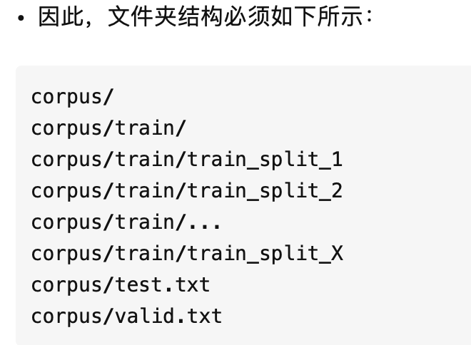
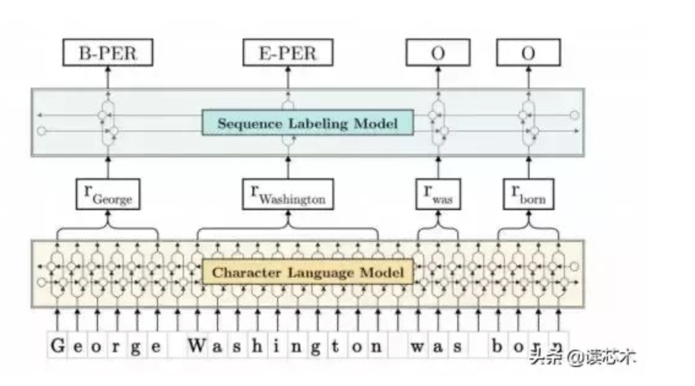

# 英文标点符号的读法

{ open brace, open curly 左花括号
} close brace, close curly 右花括号
( open parenthesis, open paren 左圆括号
) close parenthesis, close paren 右圆括号
() brakets/ parentheses 括号
[ open bracket 左方括号
] close bracket 右方括号
[] square brackets 方括号
. period, dot 句号，点
| vertical bar, vertical virgule 竖线
& ampersand, and, reference, ref 和，引用
\* asterisk, multiply, star, pointer 星号，乘号，星，指针
/ slash, divide, oblique 斜线，斜杠，除号
// slash-slash, comment 双斜线，注释符
\# pound 井号
\ backslash, sometimes
escape 反斜线转义符，有时表示转义符或续行符
~ tilde 波浪符
. full stop 句号
, comma 逗号
: colon 冒号
; semicolon 分号
? question mark 问号
! exclamation mark (英式英语) exclamation point (美式英语)
‘ apostrophe 撇号
– hyphen 连字号
— dash 破折号
… dots/ ellipsis 省略号
” single quotation marks 单引号
“” double quotation marks 双引号
‖ parallel 双线号
& ampersand = and
～ swung dash 代字号
§ section; division 分节号
→ arrow 箭号；参见号

```

p .md-image:only-child{
width: auto;
text-align: left;
}

```


```python

class Span(DataPoint):
    """
    This class represents one textual span consisting of Tokens.
    """

    def __init__(self, tokens: List[Token]):

        super().__init__()

        self.tokens = tokens
        self.start_pos = None
        self.end_pos = None

        if tokens:
            self.start_pos = tokens[0].start_position
            self.end_pos = tokens[len(tokens) - 1].end_position
            
		def to_dict(self):
      	  return {
        		    "text": self.to_original_text(),
        		    "start_pos": self.start_pos,
         			  "end_pos": self.end_pos,
         			  "labels": self.labels,
        }
```


```python
keys_list = list(temps.keys())  # Py 3: iterator -> list
# convert the dictionary to a list 
[w for w in pos if w.endswith('s')]

keys_list = list(token.keys())  # Py 3: iterator -> list
		print(keys_list)
```

https://hplgit.github.io/scipro-primer/slides/dictstring/html/dictstring-1.html


Partitial match Check if String Contains Substring [[Link]](https://stackabuse.com/python-check-if-string-contains-substring/)

```python
if token["label"].find(label) != -1:
		print("found")
```


```python
# load the model you trained
	model = SequenceTagger.load('taggers/cdr/best-model.pt')

	# make a sentence and tokenize with SciSpaCy
	sentence = Sentence("Behavioral abnormalities in the Fmr1 KO2 Mouse Model of Fragile X Syndrome",
						use_tokenizer=SciSpacyTokenizer())
	
		
	# predict tags and print
	model.predict(sentence)
	
	token = dict()
	label = "Disease"
	for s in sentence.get_spans():
		token = s.to_dict() 
		if str(token["labels"]).find(label) != -1:
			print("found")

```


```
#!/usr/bin/env python3
from flair.data import Sentence
from flair.models import SequenceTagger
from flair.models import MultiTagger
from flair.tokenization import SciSpacyTokenizer

# import the packages 
import pandas as pd
import numpy as np
import os
import sys
import random
#import pickle
#import pip_magic

def disease_accuracy_partial(templates,names,diseases,model):
	data_sentences = []
	data_disease = []
	data_range = []
	
	
	# groundtruth
	for template in templates:
		for n in names[:5]:
			for d in diseases[:5]: 
					sentence = template.replace("<NAME>",n)
					sentence = sentence.replace("<DISEASE>",d)
					#data.append(("FEMALE",sentence, n, c )) 
					#keep tracking 
					#data_input.append(("FEMALE",sentence, n, c ,sentence.index(c)+1, sentence.index(c)+len(c) )) 
					data_sentences.append(sentence)
					data_disease.append(d)  
					data_range.append(pd.Interval(sentence.index(d)+1,sentence.index(d)+len(d),closed = "both"))
				
	#prediction              
	count_tp = 0
	count_fn = 0
	count_fp = 0
	
	for sentence_text,gold,range_ in zip(data_sentences,data_disease,data_range):
		# make a sentence and tokenize with SciSpaCy
		sentence = Sentence(sentence_text,use_tokenizer=SciSpacyTokenizer())
		model.predict(sentence, embedding_storage_mode="gpu")
		
		pred = set()
		found_truth = False
		groundtruth = range_
		pred_range = pd.Interval(0,0) 
		
		token = dict()
		label = "Disease"
		
		for s in sentence.get_spans():
			token = s.to_dict() 
			if str(token["labels"]).find(label) != -1:
					pred.add(token["text"])
					pred_range = pd.Interval(token["start_pos"]+1,token["end_pos"],closed="both")
					#if (token.end_char <= groundtruth.right) or (token.start_char+1 >=groundtruth.left):
					if pred_range.overlaps(groundtruth):
						found_truth = True
						count_tp += 1      #expected               
					else:
						count_fp += 1      # predict disease but not in the disease set 
											# positive mean predict dis, false mean reality is opposite            
		# for - if Align
		if not found_truth:
						count_fn += 1      # predict not disease but in the disease set 
			
		print(count_tp, count_fp, count_fn)
		sys.stdout.flush()      
		
	Print("defined functions")
	TP = count_tp #TP
	FN = count_fn #FN
	FP = count_fp #FP
	precision = count_tp/(count_tp + count_fp)
	recall = count_tp/(count_tp + count_fn) # Partial Match
	print("TP rate is:",TP, "FN rate is:",FN, "FP rate is:",FP)
	print("precision is ", precision,"recall is ", recall)   
	
	

def main():
	
	# Names
	names = pd.read_csv("/home/xingmeng/ner/babynames_2010-2018.csv")
	names_female = names['Female Names']
	names_male = names['Male Names']
	
	print("names")
	
	with open('/home/xingmeng/ner/diseases.txt', 'r') as f:
		data = f.readlines() 
		diseases = []
		for line in data:
			diseases.append(line.strip())
	diseases = pd.Series(diseases)
	
	# Read Disease Templete from text
	with open('/home/xingmeng/ner/template_ds.txt', 'r') as f:
		data = f.readlines()  # read all string in txt to data
		templates_ds = []
		for line in data:
			templates_ds.append(line.strip())
	templates_ds = pd.Series(templates_ds)
	
		
	# load the model you trained
	model = SequenceTagger.load('taggers/cdr/best-model.pt')
	disease_accuracy_partial(templates_ds,names_female,diseases,model)
	
if __name__ == '__main__':
	main()
	
	

	
```


- Flair 具备以下特征：https://zhuanlan.zhihu.com/p/53441865
  - 强大的 NLP 库。Flair 允许将当前最优自然语言处理（NLP）模型应用于文本，如命名实体识别（NER）、词性标注（PoS）、词义消歧和分类。
  - 多语言。在 Flair 社区的支持下，该框架支持的语言种类快速增长。目前，Flair 还包括「one model, many languages」tagger，即一个模型可以预测不同语言输入文本的 PoS 或 NER 标记。
  - 文本嵌入库。Flair 的接口简单，允许用户使用和结合不同的词嵌入和文档嵌入，包括 Flair 嵌入、BERT 嵌入和 ELMo 嵌入。
  - 基于 Pytorch 的 NLP 框架。该框架直接在 Pytorch 之上构建，方便用户训练自己的模型，以及使用 Flair 嵌入与类试验新方法。

- 工具篇Flair之训练自己的Flair Embeddings

  - 准备文本语料库 https://zhuanlan.zhihu.com/p/52942546

  - 

  - ##### 训练语言模型

    - 获得此文件夹结构后，只需将LanguageModelTrainer类指向它即可开始学习模型。
    - 此脚本中的参数非常小。 作者设置隐藏的大小为1024或2048，序列长度为250，batch大小为100，得到了良好的结果。根据您的资源，您可以尝试训练大型模型，但要注意您需要一个非常强大的GPU和 很多时间训练模型（作者训练> 1周）。

    ```python
    from flair.data import Dictionary
    from flair.models import LanguageModel
    from flair.trainers.language_model_trainer import LanguageModelTrainer, TextCorpus
    
    # are you training a forward or backward LM?
    is_forward_lm = True
    
    # load the default character dictionary
    dictionary: Dictionary = Dictionary.load('chars')
    
    # get your corpus, process forward and at the character level
    corpus = TextCorpus('/path/to/your/corpus',
                        dictionary,
                        is_forward_lm,
                        character_level=True)
    
    # instantiate your language model, set hidden size and number of layers
    language_model = LanguageModel(dictionary,
                                   is_forward_lm,
                                   hidden_size=128,
                                   nlayers=1)
    
    # train your language model
    trainer = LanguageModelTrainer(language_model, corpus)
    
    trainer.train('resources/taggers/language_model',
                  sequence_length=10,
                  mini_batch_size=10,
                  max_epochs=10)
    
    ```


### 简单易用NLP框架Flair发布新版本！（附教程）

#### [Flair：一款简单但技术先进的NLP库](https://www.cnblogs.com/cuiyubo/p/10464504.html)

过去的几年里，在NLP（自然语言处理）领域，我们已经见证了多项令人难以置信的突破，如ULMFiT、ELMo、Facebook的PyText以及谷歌的BERT等等。

这些技术大大推进了NLP的前沿性研究，尤其是语言建模。只要给出前几个单词的顺序，我们就可以预测下一个句子。

但更重要的是，机器也找到了长期无法实现推测语句的关键因素。

那就是：==语境！==

对语境的了解打破了阻碍NLP技术进步的障碍。而今天，我们就来讨论这样的一个库：Flair。

至今为止，单词要么表示为==稀疏矩阵==，要么表示为==嵌入式词语==，如GLoVe，Bert和ELMo。但是，事物总有改进的空间，Flair就愿意更正不足。在本文中，首先我们将了解Flair是什么以及其背后的概念。然后将深入讨论使用Flair实现NLP任务。

Flair是由Zalando Research开发的一个简单的自然语言处理（NLP）库。 Flair的框架直接构建在PyTorch上，PyTorch是最好的深度学习框架之一。 Zalando Research团队还为以下NLP任务发布了几个预先训练的模型：

1. 名称-实体识别（NER）：它可以识别单词是代表文本中的人，位置还是名称。

2. 词性标注（PoS）：将给定文本中的所有单词标记为它们所属的“词性”。

3. 文本分类：根据标准对文本进行分类（标签）。

4. 培训定制模型：制作我们自己的定制模型。

所有的这些模型，看起来很有前景。但真正引起我注意的是，当我看到Flair在NLP中超越了几项最先进成绩的时候。看看这个目录：

注意：F1评分主要是用于分类任务的评估指标。在评估模型时，它通常用于机器学习项目中的精度度量。F1评分考虑了现有项目的分布。

二. Flair库的优势是什么？

 

Flair库中包含了许多强大的功能，以下是最突出的一些方面：

· 它包括了最通用和最先进的单词嵌入方式，如GloVe，BERT，ELMo，字符嵌入等。凭借Flair API技术，使用起来非常容易。

· Flair的界面允许我们组合不同的单词嵌入并嵌入文档，显著优化了结果。

· 'Flair 嵌入'是Flair库提供的签名嵌入。它由上下文字符串嵌入提供支持，我们将在下一节中详细了解这一概念。

· Flair支持多种语言，并有望添加新语种。


三. 用于序列标记的上下文字符串嵌入简介

 在处理NLP任务时，==上下文语境非常重要==。通过先前字符预测下一个字符，这一学习过程构成了序列建模的基础。

上下文字符串的嵌入，是通过熟练利用字符语言模型的内部状态，来产生一种新的嵌入类型。简单来说，它通过字符模型中的某些内部原则，使单词在不同的句子中可以具有不同的含义。

注意：语言和字符模型是单词/字符的概率分布，因此每个新单词或新字符都取决于前面的单词或字符。



https://www.cnblogs.com/cuiyubo/p/10464504.html

#### Python: Check if String Contains Substring

https://stackabuse.com/python-check-if-string-contains-substring/

