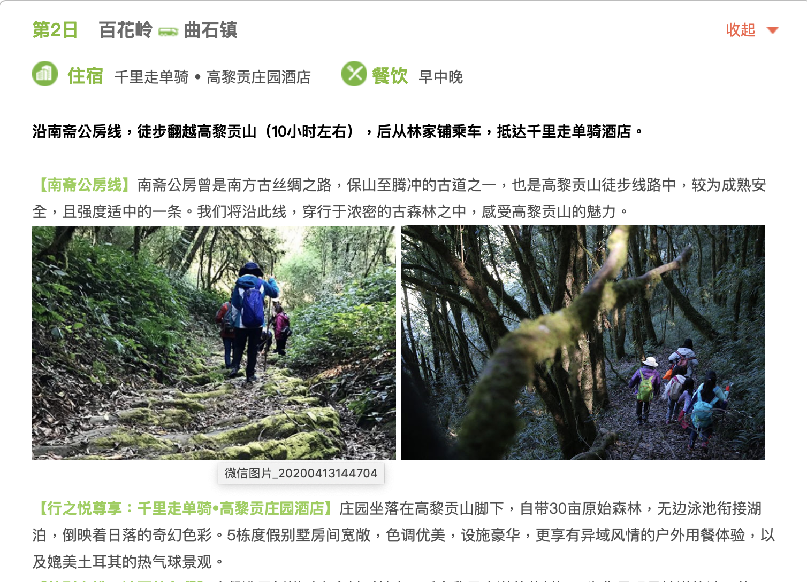
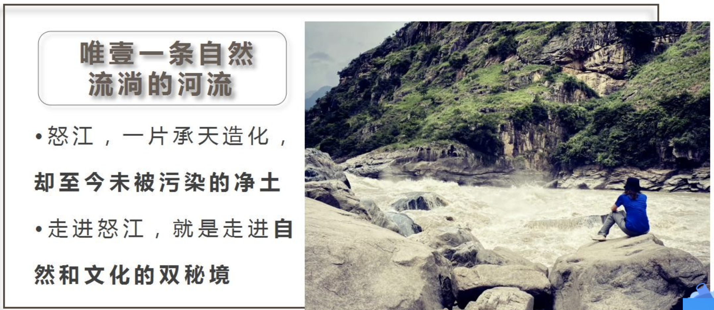

https://www.jianshu.com/p/c83068fccd7d

茶马古道

整体来说，此线路难度不大，非常适合徒步（非雨季），据说3-9月是雨季，如果是雨季感觉比较难走，会很滑，非雨季来说，这条线路感觉是非常赞的，景色宜人，植被非常丰富，而且气候也非常舒适，阳光基本背树遮住，不晒而且温度适宜。在热带雨林中的古道上徒步，非常享受，一次非常不错的徒步体验！ 

高黎贡山-南斋公房线，由保山百花岭观鸟圣地出发经18个站点，用时10h 徒步约25km 翻越高黎贡山，到达“极边第一城-腾冲”

这是一条平路仅占全路程三分之一的历史古道，是一条从1900m的起点海拔一直上升到3175m的最高点海拔的路程…

比如在高黎贡山东侧的腾冲气温明显比高黎贡山西侧的百花岭要冷。

#### 我们的行程安排

去高黎贡山对我来说是有挑战的，如果要翻越整座山，全程最快也要花8到9个小时，以我们两个的体力和行程安排，肯定是做不到的。但既然去到了那么难去到的地方，怎么也得体验一下身处高黎贡山的感觉，于是就找了百花岭客栈的老板咨询，客栈老板娘听了我的想法之后，建议我们找个向导带我们体验一程，来回大概四个小时，既能看到高黎贡山大致的面貌和徒步线路中的一些精华部分，又不至于那么累，这样的安排对我们来说简直不要太好！

于是我和龙先生立刻就决定听从老板娘的建议，如果还有多余的时间，就在百花岭周边转转，看看周边的瀑布、雨林和野温泉。

我们行程中因为也安排了腾冲的旅行，所以我们先飞到腾冲游玩了一天，再从腾冲搭了三个小时的巴士去百花岭。

百花岭在高黎贡山脚下，说是山脚， 其实是在海拔1000多米的山腰，这里既是由东到西翻越高黎贡山的起点，也是从西到东翻越的终点。百花岭对于一般旅行者来说知名度不高，但对于一些喜欢观鸟拍鸟的鸟友来说却是一个胜地，百花岭因受垂直气候的影响，每年11月，高黎贡山高海拔处的许多珍稀鸟类都飞到了温度较高的低海拔处过冬，所以每年11月都有许多鸟友专门过来拍鸟，当地政府还会举办百花岭“观鸟节”，在宣传鸟类知识的同时，吸引更多人前来观鸟。

高黎贡山自然保护区因近些年半开放旅游的原因，已经有一些徒步爱好者、动植物爱好者和专家们慕名而来，所谓半开放，就是进入高黎贡山自然保护区之前要先办入山证，并且要有护林员做向导才能进入。而办入山证和请向导，都是在百花岭完成。另外又因为观鸟的原因，百花岭近些年建了许多家庭式客栈，村民们还搭了许多鸟棚供鸟友观鸟。由于百花岭属于山区，所以这里的客栈都相对简朴一些，价格也便宜，约100元一晚。

我们走过一座水泥桥，两个一大一小热气腾腾的温泉就赫然出现在眼前了，这就是传说中的“阴阳泉”，上面的大池为男池，下面的小池为女池，女池的水是由男池流下来的，故称之为阴阳泉。

https://www.jianshu.com/p/b243622ce7e7

无意中看到这个行程，抱着试试的心态预定了这个团。体谅下来，是此次腾冲旅程中最惊艳的一部分。这次带团是李敬导游，认真，专业，热情。不仅在这次徒步的旅程过程中给我们介绍植物的知识，而且也给我们讲诉了很多有关腾冲的人文历史，给这次徒步过程的平添了很多欢笑。最后一个，东山眺望整个腾冲市贸和观赏日落为整个行程画上圆满的符号~如果你也爱徒步，请千万不要错过这个行程哦!

司机兼导游一路带我们进高黎贡山的五断溪

线路三

百花岭——旧街子——二台坡——大蜂包驿站——抗战遗址——黄竹河驿站——永定桥­——南斋公房

**最佳时期：**11月

==轻徒步路线==

Day1 

石家庄 大理

Day2 

大理 洱海 怒江 知子罗 老姆登 （老姆登客栈）

Day 3

老姆等 （石月亮）怒江第一湾 怒江大峡谷 桃花岛 丙中洛 （客栈）

Day 4 

丙中洛 秋那桶村 日照金山 雾里村 石门关 贡山神山  贡山（客栈）

**Day 5** 

贡山 泸水

**Day 6** 

泸水 百花岭（**百花岭 - 野温泉徒步**） 高黎贡山自然保护区（热带雨林） 和顺 

（热带雨林徒步认识稀有植物，泡野温泉（根据水位具体情况））

Day 7

和顺（腾冲） 热海 大理 晚上5点左右结束

https://vacations.ctrip.com/travel/detail/p27605791/?city=428

http://www.mafengwo.cn/i/12655606.html

https://travel.qunar.com/travelbook/note/6650836

http://www.mafengwo.cn/gonglve/ziyouxing/312840.html

http://www.mafengwo.cn/i/3509020.html

https://bbs.qyer.com/thread-31474-1.html?authorid=32580

http://www.mafengwo.cn/i/12655606.html

http://www.mafengwo.cn/gonglve/ziyouxing/260380.html

http://www.mafengwo.cn/gonglve/ziyouxing/312884.html

http://www.mafengwo.cn/gonglve/ziyouxing/312884.html

大理日出时间

## day3 高黎贡山百花岭

此起彼伏的鸡鸣声点亮冬夜，村子升起袅袅炊烟，我们围着火盆吃农家早餐。鉴于天气等原因，我放弃北上 [丙中洛](http://www.mafengwo.cn/travel-scenic-spot/mafengwo/17824.html) ，选择南下滇缅边陲，去体验火山温泉和边城风情，阳光和温泉才更适合这个季节。听住同一个客栈的带队导游说高黎贡山百花岭有野温泉，此时还有观鸟节。对鸟不甚感兴趣，野温泉极具吸引力，说走就走，直取百花岭。安帅对野温泉也显出极 [大兴](http://www.mafengwo.cn/travel-scenic-spot/mafengwo/29313.html) 趣，要跟我同行，欣欣然。
我们 [云龙](http://www.mafengwo.cn/travel-scenic-spot/mafengwo/63564.html) 客运站坐车3小时到 [保山](http://www.mafengwo.cn/travel-scenic-spot/mafengwo/24185.html) ，随后 [保山](http://www.mafengwo.cn/travel-scenic-spot/mafengwo/24185.html) 南站坐到芒宽的车，在百花岭村口下，提前联系的面包车50块把我们送上山。一路舟车，抵达百花岭村天色已晚，温泉只能明天一早去。入住的客栈旁边就是保护区宣教中心，中心的教员带我们参观展览馆，向我们展示高黎贡山之美。在中心小院儿里，我们跟傈僳族的几个姑娘小伙一起围着火盆烤火。他们在这儿住宿排练，谈起后天芒宽乡举办首届阔时节，是他们傈僳族的春节。看来，下一站又有着落了。晚上我们来了只高山土鸡改善伙食，4斤的鸡，大快朵颐。晚饭过后开始下雨，老乡说已经三个多月没下过雨，久旱甘霖，说我们是贵客，笑着入睡

## day4 高黎贡山百花岭阴阳谷野温泉

倾盆大雨一整夜，晨起雨还在下，我们想着干脆睡上一整 [天全](http://www.mafengwo.cn/travel-scenic-spot/mafengwo/63015.html) 当休整，吃完早饭就开始回笼觉。没曾想十点雨住，我们激动地蹦下床，背上行囊高歌猛进上山，高黎贡山脉山体氤氲，宛若仙境。徒步约45分钟，我们抵达阴 [阳谷](http://www.mafengwo.cn/travel-scenic-spot/mafengwo/144209.html) 温泉，但因降雨量过大，山上的水汹涌而下，用来调节水量的机关完全无法发挥作用。大小温泉因此浊且冷，好在旁边仍有三个小泉可以用来分别泡脚煮蛋沏茶，两包毛嗑儿就着滇红，我跟安帅各种侃大山，笑声响彻山谷，任时光流逝如水。
下午来了一位 [东北](http://www.mafengwo.cn/travel-scenic-spot/mafengwo/16215.html) 大哥，姓李，温泉边的帐篷也是他的，他最近每天都来，像收拾自家小院儿一样打理温泉四周。他是设计师，常住 [大理](http://www.mafengwo.cn/travel-scenic-spot/mafengwo/10487.html) ，此行计划为期45天的禅修。我们一边喝茶，一边畅谈。敬仰他的仙风道骨，博闻广识，年届半百，仍是翩翩少年。我们相约明天继续来，虽然没泡成，但依然满足。今天的经历恰似人生，起落无常，塞翁失马，焉知非福。总还是要有对昨日的感念，对当下的珍惜，对明天的希冀。再逗留一日，晚上继续吃鸡。

## day6 腾冲和顺古镇

我去 [腾冲](http://www.mafengwo.cn/travel-scenic-spot/mafengwo/10651.html) ，安帅去 [保山](http://www.mafengwo.cn/travel-scenic-spot/mafengwo/24185.html) ，我们击掌道别，各奔东西。从 [诺邓](http://www.mafengwo.cn/travel-scenic-spot/mafengwo/17823.html) 开始结伴，同行数日，志同道合，芒宽这一夜我们还同住了一夜风情情侣房。月有盈亏人有离合，好兄弟，一路珍重，来日江湖重逢。坐芒宽至 [腾冲](http://www.mafengwo.cn/travel-scenic-spot/mafengwo/10651.html) 的班车，3个小时抵达 [腾冲](http://www.mafengwo.cn/travel-scenic-spot/mafengwo/10651.html) 客运站。
提前预定了 [和顺](http://www.mafengwo.cn/travel-scenic-spot/mafengwo/16491.html) 古镇的青旅，路上滴滴司机跟我推荐荷花乡温泉，来之前我大概也略知 [腾冲](http://www.mafengwo.cn/travel-scenic-spot/mafengwo/10651.html) 的几大温泉，但此刻却我了无兴致。显然，我已然回归城市文明，泡温泉得穿泳衣，不能放声高歌，煮不了鸡蛋泡不了茶，人多了心远了。阴 [阳谷](http://www.mafengwo.cn/travel-scenic-spot/mafengwo/144209.html) ，世外 [桃源](http://www.mafengwo.cn/travel-scenic-spot/mafengwo/63581.html) ，怀念但不留恋。好在 [和顺](http://www.mafengwo.cn/travel-scenic-spot/mafengwo/16491.html) 古镇还算宁静，四下游荡了片刻，回到客栈，晒晒太阳喝喝茶，坐等日落。

## day7 江苴古村

入住的客栈是复式木屋结构，颇具古风，一夜梦回唐朝，自然醒，小轩窗，凭栏望，日出东方，万山红遍。 [腾冲](http://www.mafengwo.cn/travel-scenic-spot/mafengwo/10651.html) 作为边陲名城，周边景观确实不少，但对于被圈起来收门票的景点我已全无兴致。随农村客运小巴进村，车载音响放着老歌，我跟着司机一路浅唱，抵达江苴古镇。
江苴古镇，《我的团长我的团》《边城》等多部知名电视剧的拍摄地，南丝路茶马古道上的驿站，古迹保护得不算好，村子被晨雾笼罩。走进一户农家，84岁的奶奶在酿小锅米酒，坐着跟她聊天，她说小辈们已经不再这么做了，费时费力，奶奶给我斟了一杯，醇香甘甜。雾气渐散，看高黎贡山拨云见日，微醺，依稀看到一支马队山间走来。
下午回到 [腾冲](http://www.mafengwo.cn/travel-scenic-spot/mafengwo/10651.html) ，滇西抗战纪念馆是必须要到的，月初刚看完几本抗日战争细节披露，伫立在警钟碑记前默念碑文，心潮澎湃。此刻的岁月静好，是因为有先辈们的负重前行，他们才是改变了世界的人，铭记历史。

而怒江是多民族自治区，有傈僳、怒族、白族、独龙族，信仰的宗教也是五花八门，让人诧异的是这里信奉最多的居然是天主教，这或许是让很多人不解的地方。可见当年的传教士，是多么的执着，这么偏远，都不惧千辛万苦来到这里传教，并生根发芽。

### 茶马古道

雾里村旁有一条在山崖上开凿的栈道通往朝红桥，贴着崖壁的路极窄，奔流的怒江就在栈道下翻腾，这是雾里村以前通往外界的唯一通道。田壮壮《德拉姆》、刘杰的《碧罗雪山》都拍摄于此。

http://www.mafengwo.cn/gonglve/ziyouxing/312840.html

[丙中洛](http://www.mafengwo.cn/travel-scenic-spot/mafengwo/17824.html) -雾里村-秋那桶-初岗村

### 行程物品参考

1、背包（45L-55L），或者小拉杆箱(24寸以内，平时可丢车上或者宾馆)还可配个摄影包或小腰包活动时候用；
2、户外三件套(冲锋衣、速干衣、抓绒)保暖衣太阳镜、遮阳帽、旅游用鞋，可购置一些一次性雨披便于步行和遮挡摄影设备；
3、感冒药、肠胃药、维它命、创可贴、风油精；
4、防晒霜+保湿润肤水+护手霜+护唇(MM必备)；
5、各种数码产品及充电器、摄影器材；
6、备一些干粮、水果和零食保温水壶；
7、洗漱用品换洗衣物；
8、身份证件，至关重要。

##### 行前准备

携带品：1.现金1200左右（包括几十块的零钱）-------主要用于饮食（贵州很多地方不能使用支付宝），大巴费，景点门票（有些景点不能刷卡）等。省外ATM取钱1000以内，手续费是5块到10块，也不算特别贵，不够现金，可以随时留意身边有没有ATM，在贵州云南比较繁华的地方一般都能看到ATM。

​       2.防晒霜（SPF40以上的）以及保湿霜必带！！！否则会在云南严重被晒干。女生最好就是，暴露在阳光下的皮肤都要涂防晒，千万不能嫌麻烦。

​      3.纸巾（10天------卷纸：2卷/人，小包纸巾5包/人；女生最好就是得带上卫生巾，以防万一）

​      4.厚衣服（5,6月份的话，最好一件冬天的外套，一件针织衫，云南早晚温差很大，晚上的[香格里拉](https://travel.qunar.com/p-cs1002765-xianggelila)穿三件都还有点冷）

​      5.身份证，学生证（有学生证的话，一定要带，基本上门票都可以半价）....

​      6.药（如：肠胃药，晕车药），创口贴

​      7.遮阳帽（什么类型的看自己喜好，最好就是大顶一点。）

​      7.拖鞋，雨伞，手机，手机充电宝，充电器，银行卡（2500左右）等

观鸟望远镜

植物

### 天气预报

### 美食篇

老窝火腿，老窝火腿因产在[泸水](http://travel.sina.com.cn/nujiang_shui_16488-lvyou/?from=b-keyword)县老窝乡而得名，是怒江远近闻名的原生态特色产品。

烤乳猪是一道当地土著民族的传统美食。

手抓饭， 客人在吃“手抓饭”前必须先洗手，然后大家围着簸箕坐在一起，以左手当碗，右手当筷，抓吃簸箕里自己喜欢的米饭菜肴，然后放到左手里捏在一起成团，送入嘴中，故称“手抓饭”。

侠拉，怒族语言即用酒煮肉之意，一般用土鸡肉和上好的烧酒作原料。

石板粑粑

土鸡

当地人告诉我们现在还不算是吃菌子的时候，但也有些新鲜的菌子，我们吃了八种：牛肝菌、松乳菇、见手青、红乳牛肝菌、鸡油菌、香莲头菌、红葱菌、粉菌、鸡纵菌。大家一致觉得最好吃的是红乳牛肝菌，滑溜溜的溜进肚子里带着菌菇的香气。火锅汤底是鸡汤，加菌子煮开二[十分](https://place.qyer.com/poi/V2wJZ1FiBzNTbA/)钟后先喝汤，再吃菌子。这二十分钟可真是难熬，大家都巴巴的看着锅里汤一点点变得滑腻起来，咽咽口水，干什么事儿眼睛都挪不开过锅。

在这家店里我们吃了来腾冲的第一碗“大救驾”。大救驾是云南十八怪之小吃，实际就是炒饵块，将饵块切成小片，再加上火腿、鸡蛋、肉、萝卜、番茄等，一起放在锅中爆炒而成。

【第二次在柴火炒菜大院吃的大救驾，Photo by W】

在桃花岛上，我们将吃到由当地老乡制作的地道美食，“杵酒”（用包谷、稗子等酿制而成），霞拉（用鸡肉熬制的米酒）、琵琶肉，石板粑粑...除此之外，稻稻还在福贡为大家包下了一顿当地特色的手抓饭！

热海滇西抗战纪念馆

怒族手抓饭

六库的美食更是数不胜数，当然我们在此就不分别一一介绍了，到六库可以自行去尝尝傈僳族手抓饭 、漆油鸡、烤小猪、各种傣味小吃、烤鸡、烤鱼等等，最值得一提的六库晚上的烧烤我个人觉得特别推荐的，在海拔不到1000米的六库（实际估计在860米左右吧）被滚滚怒江分成东西两头，住宿东西都有，各种条件的酒店、客栈俱全，峡谷中有时候还挺热的，晚上吃些烧烤、喝喝啤酒，逛一逛东西两岸并不大的六库夜景，完美地享受！

高黎贡山穿越徒步行一共2条路线，其中，从保山芒宽百花岭经南斋公房到腾冲江苴的线路最为成熟。此线为南方丝绸之路的高黎贡山段，跋涉在古老驿道，感受昔日车水马龙的喧嚣，感怀马帮文化的深沉是此线的主题。此外，百花岭附近的温泉、大瀑布等自然景观，满山堆积的腐叶，随处可见的蘑菇，高负氧离子的原始森林都将带给徒步者不同的体验。最适合徒步行的时间为每年的11月至4月，此时降水量相对减少很多。此外，钟情杜鹃花的朋友们注意了，杜鹃花三月底四月初盛开。

**如何到达腾冲？**

　　腾冲目前不通火车，到腾冲主要有两种方式：飞机&汽车[汽车]①昆明—腾冲往：在昆明西部客运站乘坐，票价根据车的类型而定，一般218-290元之间，距离670km，上午9点到11点之间会有三班，下午6点到9点之间会有6班。车程约9-11小时（晚上乘坐会有3小时的深夜休息，时间更长），分坐票与卧铺车，车次较多，到达腾冲旅游客运站。

### 人文行程

腾冲温泉

独龙族游玩 http://www.mafengwo.cn/i/19738849.html

因疫情和道路维修，很多景点都不能去，我们只到了4一5个景点，重点去了普卡旺村 [和龙](http://www.mafengwo.cn/travel-scenic-spot/mafengwo/64860.html) 元村探访纹面女，因时间关系，其他景点去了也只是一带而过。

普卡旺村的网红桥 http://www.mafengwo.cn/i/19738849.html

《中国国家地理》“滇藏新通道”专题记述，“丙察察：神秘的滇藏新通道”、“滇藏新通道（丙察察线）极限挑战全记录”。“自驾丙察察线——再也不想来第二次的精彩体验”。“穿越丙中洛-察瓦龙-察隅-然乌-邦达-芒康-德钦-中甸”。“丙察察线：最艰难的进藏之旅?”。

这里游客罕至，人烟稀少，如翡翠般清澈碧绿的独龙江流淌在苍翠的崇山峻岭间，是一处难得的世外桃源。

**NO.2普卡旺** https://new.qq.com/omn/20190919/20190919A0RW7700.html

https://www.fliggy.com/content/d-210165971303?ttid=seo.000000576&seoType=origin	

