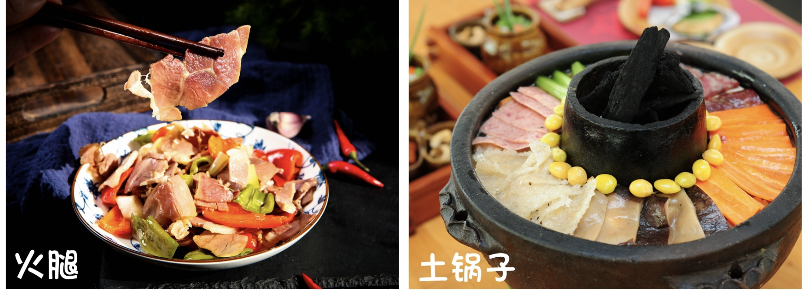
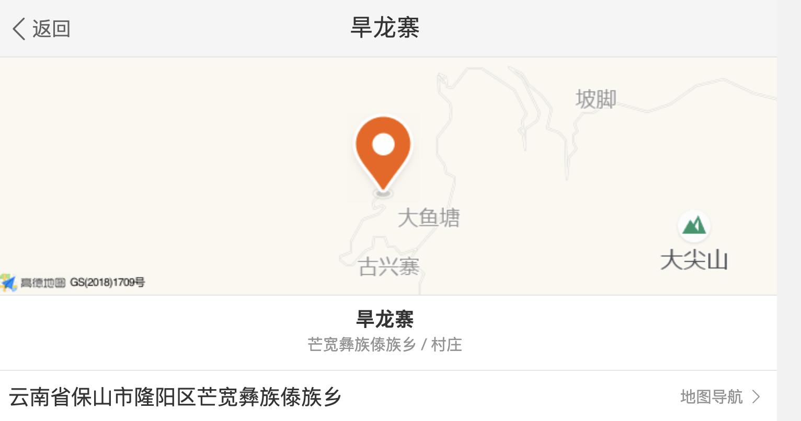

https://bbs.qyer.com/thread-3434261-1.html

https://blog.sina.cn/dpool/blog/s/blog_4c2b504e0102w1ya.html?md=gd

**DAY2 腾冲—潞江坝咖啡庄园—百花岭—野温泉徒步**

用餐：含早，正餐敬请自理

住宿：百花岭农家

徒步：徒步约8KM，用时：约2H

早餐后，前往美丽富饶的怒江峡谷小镇——==潞江坝==。因受高黎贡山的影响，生长在此的==小粒咖啡==，一年四季吸收日月之精华，集纳天地之灵气，品质上乘，声名远播。潞江坝位于怒江河谷之中，背靠高黎贡山，有着得天独厚的环境资源。云南保山潞江小粒咖啡已经成为了“国家地理标志产品”，是全国及至全球咖啡品质较好的咖啡之一，其口感可。以与闻名世界的蓝山咖啡相媲美。

我们将背上小竹篓，前往高黎贡山下的咖啡园进行咖啡采摘，怒江河谷的美景，咖啡园里的山居田园生活，无比惬意！很难想象，70年前，这里发生过惨烈的战斗......之后，我们回到咖啡庄园，体验把咖啡从生豆到成品的整个过程，去皮，晾晒，脱壳，烘焙，研磨，冲泡......品鉴各个品种的咖啡。下午，我们将品尝当地的少数民族的待客宴席长桌宴，最后，我们前往百花岭入住农家。

入住后，小伙伴可以一起开启原始森林徒步之旅，探秘高黎贡山未经开发的【野生温泉】—阴阳谷温泉！高黎贡山被誉为“世界物种的基因库”，原始森林中，物种何其丰富。飞溅的瀑布打在野芭蕉叶上，变成一颗颗晶莹剔透的露珠滑落。深山中，迷雾缭绕，两眼温泉从火山岩层间涌出！每到过年过节的时候，当地人就会来到这里，用温泉水祛病养生！我们要在这里感受空谷幽林，鸟儿齐鸣的森林泡汤。

